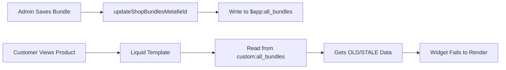

# Critical Fix: Metafield Namespace Mismatch

## 🐛 Issue Description

**Date Discovered:** 2025-01-04
**Severity:** Critical - Widget completely non-functional
**Symptoms:** Bundle widget container appeared on page, but step boxes/cards were never rendered

## Root Cause

**Metafield Namespace Mismatch** between write and read operations:

- **Backend (Write):** Saved bundle data to `$app:all_bundles` metafield
- **Frontend (Read):** Liquid template read from `custom:all_bundles` metafield

### The Problem Flow



### What Happened

1. **Initial Setup**: An older version of the code wrote bundle data to `custom:all_bundles`
2. **Code Change**: Later, someone changed the namespace to `$app` in the save function
3. **Liquid Template**: Continued reading from `custom:all_bundles` (the old metafield)
4. **Result**:
   - Backend successfully saved new bundle to `$app:all_bundles`
   - Frontend kept reading stale data from `custom:all_bundles`
   - Bundle ID mismatch (`cmfb0n2pt000010fk29bqli86` vs `cmgaxiql30000v7rwmy86rmlu`)
   - Widget initialization failed because no matching bundle found

## 🔧 The Fix

### File: `app/routes/app.bundles.cart-transform.configure.$bundleId.tsx`

**Line 649 - Changed namespace from `$app` to `custom`:**

```diff
  const response = await admin.graphql(SET_SHOP_METAFIELD, {
    variables: {
      metafields: [
        {
          ownerId: shopGlobalId,
-         namespace: "$app",
+         namespace: "custom",
          key: "all_bundles",
          type: "json",
          value: JSON.stringify(formattedBundles)
        }
      ]
    }
  });
```

### Why `custom` Namespace?

The `custom` namespace is the recommended namespace for merchant-facing metafields in Shopify:

- ✅ Accessible in Liquid without special prefixes
- ✅ Can be queried from storefront
- ✅ Proper for app-to-theme communication
- ❌ `$app` namespace is for app-internal use only and has access restrictions

## 📋 Verification Steps

After applying the fix:

1. **Save Bundle** - Triggers metafield update to correct namespace
2. **Check Server Logs:**
   ```
   ✅ [SHOP_METAFIELD] Shop bundles metafield updated successfully
   📋 [SHOP_METAFIELD] Total bundles in metafield: 1
   ```

3. **Refresh Product Page** - Hard reload (Ctrl+Shift+R)
4. **Check Console Logs:**
   ```javascript
   🔍 [BUNDLE_DATA] Primary data structure: {cmgaxiql30000v7rwmy86rmlu: {...}}
   ✅ [WIDGET] MANUAL BUNDLE ID MATCH: Found configured bundle: CT_T
   ```

5. **Visual Confirmation:** Bundle step cards/boxes with '+' icons should render

## 🚨 Prevention Checklist

To avoid similar issues in the future, follow this checklist:

### 1. Metafield Consistency Check

Create a test that verifies read/write namespace consistency:

```typescript
// test: metafield-consistency.test.ts
describe('Metafield Namespace Consistency', () => {
  it('should use the same namespace for read and write', () => {
    // Extract namespace from save function
    const saveNamespace = extractNamespaceFromSave();

    // Extract namespace from Liquid template
    const readNamespace = extractNamespaceFromLiquid();

    expect(saveNamespace).toBe(readNamespace);
  });
});
```

### 2. Code Review Checklist

When reviewing metafield-related PRs:

- [ ] Verify namespace matches between save and read operations
- [ ] Check if metafield is accessible in the context it's being read from
- [ ] Confirm metafield type is correct (`json`, `single_line_text_field`, etc.)
- [ ] Validate metafield key is consistent across all references
- [ ] Test with actual data to ensure Liquid can parse the JSON

### 3. Documentation Requirements

Every metafield usage should be documented:

```typescript
/**
 * Shop-level bundle data metafield
 *
 * @namespace custom
 * @key all_bundles
 * @type json
 * @write app/routes/app.bundles.cart-transform.configure.$bundleId.tsx:649
 * @read extensions/bundle-builder/blocks/bundle.liquid:394
 * @description Contains all active cart transform bundles for the shop
 */
```

### 4. Naming Convention

Use consistent naming to make mismatches obvious:

```typescript
// ✅ GOOD - Clear and consistent
const SHOP_BUNDLES_METAFIELD = {
  namespace: 'custom',
  key: 'all_bundles',
  type: 'json'
} as const;

// Use constant everywhere
admin.graphql(SET_METAFIELD, {
  variables: {
    metafields: [SHOP_BUNDLES_METAFIELD]
  }
});

// In Liquid template comment:
// Reading from: custom:all_bundles (see SHOP_BUNDLES_METAFIELD in code)
```

### 5. GraphQL Verification Query

Add this to your development workflow:

```graphql
# Verify shop metafield after save
query VerifyShopMetafield {
  shop {
    custom_all_bundles: metafield(namespace: "custom", key: "all_bundles") {
      id
      namespace
      key
      value
    }
    app_all_bundles: metafield(namespace: "$app", key: "all_bundles") {
      id
      namespace
      key
      value
    }
  }
}
```

Run this after saving bundles to ensure data is in the correct location.

### 6. Automated Testing

Add integration test:

```typescript
describe('Bundle Widget Integration', () => {
  it('should render step boxes after bundle save', async () => {
    // 1. Save bundle via admin API
    await saveBundle(testBundle);

    // 2. Query shop metafield
    const metafield = await getShopMetafield('custom', 'all_bundles');

    // 3. Verify bundle ID matches
    expect(metafield.value).toContain(testBundle.id);

    // 4. Simulate Liquid template reading metafield
    const liquidData = JSON.parse(metafield.value);

    // 5. Verify bundle object has correct ID
    expect(liquidData[testBundle.id].id).toBe(testBundle.id);
  });
});
```

## 📊 Monitoring

Add logging to detect namespace mismatches:

```typescript
// In updateShopBundlesMetafield function
console.log('📝 [METAFIELD_AUDIT] Writing to:', {
  namespace: 'custom',
  key: 'all_bundles',
  bundleIds: allBundles.map(b => b.id),
  timestamp: new Date().toISOString()
});
```

```liquid
<!-- In bundle.liquid template -->
<script>
  console.log('📖 [METAFIELD_AUDIT] Reading from:', {
    namespace: 'custom',
    key: 'all_bundles',
    bundleIds: window.allBundlesData ? Object.keys(window.allBundlesData) : [],
    timestamp: new Date().toISOString()
  });
</script>
```

## 🔍 Debugging Commands

If widget doesn't render, run these in browser console:

```javascript
// 1. Check what metafield Liquid read
console.log('Liquid metafield data:', window.allBundlesData);

// 2. Check expected bundle ID
const expectedBundleId = document.getElementById('bundle-builder-app')?.dataset.bundleId;
console.log('Expected bundle ID:', expectedBundleId);

// 3. Check if bundle exists in data
console.log('Bundle exists:', !!window.allBundlesData?.[expectedBundleId]);

// 4. If exists, check if ID matches
if (window.allBundlesData?.[expectedBundleId]) {
  const bundle = window.allBundlesData[expectedBundleId];
  console.log('Bundle ID match:', bundle.id === expectedBundleId);
  console.log('Bundle object ID:', bundle.id);
  console.log('Expected ID:', expectedBundleId);
}
```

## 📚 Related Files

Files involved in this fix:

1. **Backend (Write):**
   - `app/routes/app.bundles.cart-transform.configure.$bundleId.tsx` (Line 649)
   - `app/routes/api.refresh-shop-metafield.tsx` (Already correct)

2. **Frontend (Read):**
   - `extensions/bundle-builder/blocks/bundle.liquid` (Line 394)

3. **Widget Logic:**
   - `extensions/bundle-builder/assets/bundle-widget.js` (Bundle selection logic)

## 🎓 Lessons Learned

1. **Always document metafield namespaces** in code comments
2. **Use constants** for metafield configuration to prevent typos
3. **Test read/write paths** together, not in isolation
4. **Add logging** at both write and read points with the namespace
5. **Create integration tests** that verify the complete flow
6. **Review Shopify docs** on metafield namespaces before choosing one

## ✅ Success Criteria

The fix is successful when:

- ✅ Bundle step boxes render on container product page
- ✅ Server logs show correct namespace in save operation
- ✅ Browser console shows bundle data is loaded
- ✅ Bundle ID matching succeeds
- ✅ Modal opens when clicking step boxes
- ✅ Cart transform functions work correctly

---

**Last Updated:** 2025-01-04
**Fixed By:** Claude Code Session
**Impact:** Critical functionality restored
