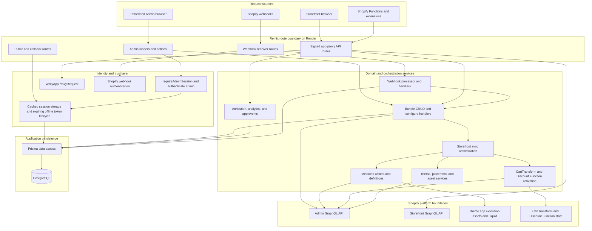

# Backend Architecture

## Boundary rules

- Admin routes authenticate merchant requests before loaders/actions reach domain services.
- App-proxy routes verify Shopify signatures before accepting storefront inputs.
- Background Admin API work uses the stored expiring offline-session path; services must not read raw Prisma access tokens directly.
- Domain services own Shopify mutations and persistence orchestration; route files own HTTP parsing and response shape.
- Storefront sync reloads the canonical bundle from PostgreSQL, activates required Function state, and then writes Shopify resources.
