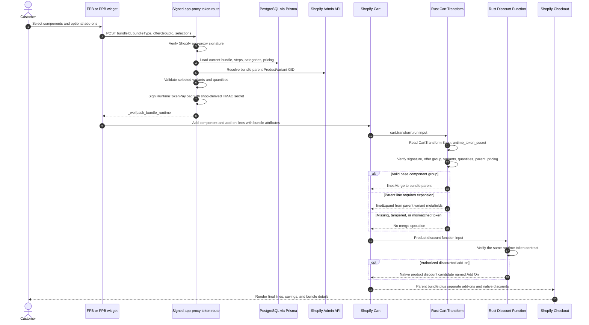

# Cart Transform Runtime Architecture

## Trust boundaries

- Storefront selections are untrusted until the signed app-proxy route validates them against the current database bundle.
- The HMAC secret is derived server-side and synchronized to the active CartTransform owner as `$app.runtime_token_secret`.
- Cart Transform and Discount Function independently reject missing, tampered, or selection-mismatched tokens.
- Add-on lines stay outside the parent `linesMerge`; authorized add-on savings are emitted by the Discount Function.
