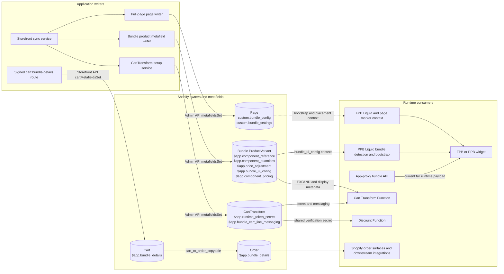

# Metafield Design and Consumption

## Ownership and lifecycle

| Owner | Namespace/key | Primary writer | Primary consumer | Lifecycle note |
|---|---|---|---|---|
| Page | `custom.bundle_config` | Full-page page writer | FPB Liquid/page marker context | Synced with the linked Shopify page; runtime still hydrates current bundle data through the app proxy. |
| Page | `custom.bundle_settings` | Full-page page writer | Display/bootstrap context | Keeps lightweight display settings separate from the full config. |
| Bundle ProductVariant | `$app.bundle_ui_config` | Bundle product metafield writer | PPB Liquid context | Detects the product-page bundle and provides bundle identity; widget fetches current runtime data from the app proxy. |
| Bundle ProductVariant | `$app.component_reference`, `$app.component_quantities` | Bundle product metafield writer | Cart Transform | Supplies the EXPAND component contract. |
| Bundle ProductVariant | `$app.price_adjustment`, `$app.component_pricing` | Bundle product metafield writer | Cart Transform | Supplies pricing and component display data for parent-line expansion. |
| CartTransform | `$app.runtime_token_secret` | CartTransform setup service | Cart Transform and Discount Function | Must match the shop-derived server signing secret. |
| CartTransform | `$app.bundle_cart_line_messaging` | CartTransform setup service | Cart Transform | Controls Function-side cart-line messaging. |
| Cart | `$app.bundle_details` | Signed app-proxy route via Storefront API | Shopify copy pipeline | Accumulates bundle display properties by bundle instance. |
| Order | `$app.bundle_details` | Shopify cart-to-order copy | Order surfaces and downstream integrations | Enabled by matching app config definition with `cart_to_order_copyable`. |

Component-variant `$app.component_parents` is intentionally absent: signed runtime-token validation is the current MERGE authorization source.
