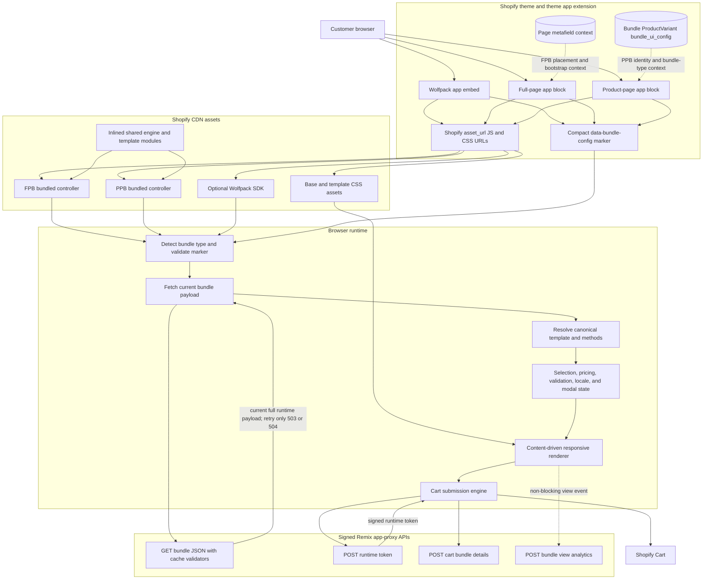

# Storefront Frontend Architecture

## Runtime boundaries

- Liquid owns placement, compact identity/bootstrap context, and Shopify CDN asset URLs.
- The app-proxy bundle endpoint owns current full runtime configuration for both FPB and PPB.
- Widget entry files compose shared engine modules and template-specific method/config modules into the active renderer.
- Browser state is storefront-local; it does not use the Admin Redux store.
- The cart submission path requests authorization immediately before adding lines, then synchronizes `bundle_details` separately for order metadata.
